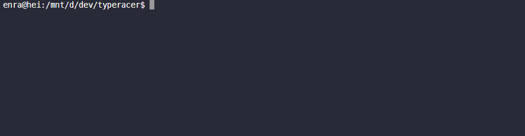

# typeracer




## Install

```
# npm install --global typeracer
```

## Host server

Clone and run [typeracer-server](https://github.com/enra4/typeracer-server)

## Things to know

If you want to add quotes, you have to do it manually in `quotes.json`. I might make it easier to do this in the future.

Records are stored in `~/.typeracer-records.json` if you're interested.
